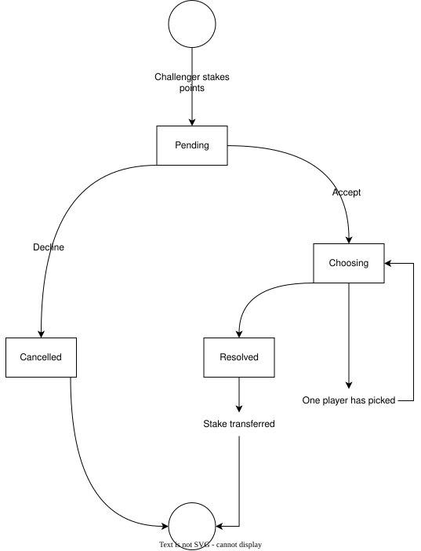

<div align="center">


# Necobot

**A Discord bot with a points economy, minigames, and a local LLM that answers in character.**

It runs continuously on a private server and its my testbed for whatever I want to learn next.

<br>

[](https://www.typescriptlang.org/)
[](https://www.sapphirejs.dev/)
[](https://www.sqlite.org/)
[](https://orm.drizzle.team/)
[](https://ollama.com/)
[](https://www.docker.com/)
[](https://github.com/features/actions)

[](https://github.com/ManusolJ/Necobot/actions/workflows/ci.yml)
[](https://github.com/ManusolJ/Necobot/commits)

<a href="#-what-it-does">What it does</a> ·
<a href="#-technical-notes">Technical notes</a> ·
<a href="#-tech-stack">Tech stack</a> ·
<a href="#-running-it">Running it</a> ·
<a href="#-status-and-roadmap">Roadmap</a>

</div>

---

Two things at once: its a working bot with points economy, minigames, an LLM-backed
conversational layer and a testbed for technologies I want to try. When I want to
learn something new, I usually implement it here first.

---

## What it does

Everything the bot offers hangs off a **points economy**. Points are earned,
spent, wagered, gifted and confiscated, so the features interlock rather than sitting
next to each other as unrelated toys.

### Earning and holding

| Command   | Behaviour                                                                                                                                                      |
| :-------- | :------------------------------------------------------------------------------------------------------------------------------------------------------------- |
| `beg`     | Grants a random amount of points, with a chance to fail outright. Users holding a specific role get one automatic second attempt. Always answers in character. |
| `balance` | Current point total.                                                                                                                                           |
| `profile` | Full user card: points plus tracked stats - trivia won, mines stepped on, and so on.                                                                           |
| `gift`    | Transfer points to another user.                                                                                                                               |

### Spending

| Command     | Cost      | Behaviour                                                                                                                                                                                        |
| :---------- | :-------- | :----------------------------------------------------------------------------------------------------------------------------------------------------------------------------------------------- |
| `minefield` | 20 / mine | Plants mines in a text channel. Every message sent there afterwards has a 2% chance of detonating one: a 30-second timeout for regular users, or −50 points for admins, who cannot be timed out. |
| `speak`     | 40        | Joins the caller's voice channel and plays a sound.                                                                                                                                              |
| `duel`      | wagered   | Challenge another user, winner takes the stake. [Detailed below.](#the-duel-is-a-multi-step-stateful-interaction)                                                                                |

### Utilities

| Command    | Behaviour                                                                               |
| :--------- | :-------------------------------------------------------------------------------------- |
| `reminder` | Schedules a reminder for X minutes, hours or days out, with an optional custom message. |
| `roll`     | Standard `XdY` dice roll.                                                               |
| `cheer`    | Sends a birthday message and image to a chosen user.                                    |

### Administration

| Command       | Behaviour                                                    |
| :------------ | :----------------------------------------------------------- |
| `add-channel` | Registers a channel for specific bot uses.                   |
| `exclude`     | Opts a user out of bot activities entirely.                  |
| `punish`      | Removes points from chosen users.                            |
| `settings`    | Configures per-guild behaviour, such as the primary channel. |

---

## Technical notes

### The duel is a multi-step stateful interaction

`duel` is the most involved thing in the codebase. The challenger stakes points and
names an opponent; the bot posts an embed with **Accept** and **Decline** buttons.
Declining ends it (with an insult). Accepting swaps the same message's components for
rock–paper–scissors, and the bot then waits for both players to choose before resolving
and transferring the stake.

<div align="center">
  
</div>

This means holding interaction state across multiple messages and users, mutating a live
message's components in place, authorising each button press against the right player,
and resolving only once both inputs have arrived. A very small state machine, and the
proof of concept for future minigames.

### In-character LLM responses via a local model

Mentioning the bot with `@` routes the message to a locally hosted model through
[Ollama](https://ollama.com/), which answers in the bot's persona.

> [!NOTE]
> The responses are frequently incoherent and rarely useful. **This is mostly
> intentional** - the goal was a character with a voice, not a support assistant, and a
> bot that confidently answers wrong is funnier.

Running the model locally rather than against a hosted API also means no API key, no
per-token cost, and no message content leaving the machine. The current model is
`salamandra-7b-instruct`, chosen because it had the best Spanish of the ones I tried -
subject to change.

### Event handling

Two kinds:

- **Reactive** - mention handling, minefield detonation on every message in a mined
  channel, and diagnostics for denied commands and runtime errors.
- **Scheduled** - currently only the infrastructure exists. See the
  [roadmap](#-status-and-roadmap).

### Persistence

SQLite with **Drizzle** and versioned migrations in `db/migrations`.

Migrations seemed overkill, but between the constant schema churn and the need to
preserve points, they earned their place. Versioning the schema means the running
instance can be updated without losing the state that makes the economy worth
participating in.

### Opt-out is a first-class feature

`exclude` removes a user from bot activities completely. Not everyone in a server wants
to be minefield-eligible or duel-challengeable.

### This is the third rewrite

Version one worked and was a mess: no structure, errors surfacing everywhere, command
handling and business logic tangled together. Version two improved it. Version three -
this one - is the rewrite where I stopped hand-rolling the plumbing:

- **Sapphire** for command registration, preconditions and centralised error handling,
  instead of my own dispatcher.
- **A layered structure** separating commands, event listeners, database access and the
  AI client.
- **CI on GitHub Actions**, so a broken build never reaches the server.
- **Containerised deployment** with a versioned deploy script.

> The lesson that stuck: the first version taught me what the bot needed to do, and
> trying to keep extending it taught me why structure exists. Neither lesson was
> available without writing the bad version first.

---

## Tech stack

| Layer          | Technology                                       |
| :------------- | :----------------------------------------------- |
| **Language**   | TypeScript                                       |
| **CI**         | GitHub Actions                                   |
| **Quality**    | ESLint, Prettier                                 |
| **Framework**  | Sapphire (discord.js)                            |
| **AI**         | Ollama, locally hosted model                     |
| **Deployment** | Docker, self-hosted on a personal Linux server   |
| **Database**   | SQLite with Drizzle ORM and versioned migrations |

---

## Running it

**Requirements:** Docker, and an Ollama instance reachable from the container.

```bash
git clone https://github.com/ManusolJ/Necobot.git
cd Necobot

cp .env.example .env
# Discord bot token, application ID, database path and Ollama endpoint

docker compose up --build
```

> [!IMPORTANT]
> `.env.example` documents every required variable.

---

## Status and roadmap

Live and in continuous use on one private server. Not built to be a public, multi-guild
bot.

- [ ] **Scheduled features** on top of the existing task infrastructure: a daily
      greeting, a weekly lottery.
- [ ] **Automated tests** - CI currently builds and lints but does not test.
- [ ] **More minigames** feeding the same economy.

---

<div align="center">

### Author

**Manuel Soler Juan** - Junior full stack developer

[](https://github.com/ManusolJ)
[](https://linkedin.com/in/manusolerj)

</div>
